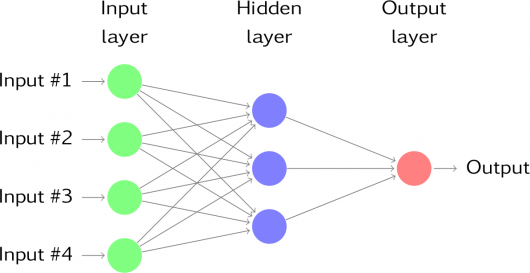

# NLP_641
Natural Language Processing Project

## Introduction

Sentiment analysis is an application of natural language processing (NLP) that reveals the emotional states in human speech or text, and in this case, the speech and text that customers generate. Style transfer is generally a method used specifically for images and transferring the style of one image to the desired image. For text, we can transfer the style of a particular text to the desired text (e.g Shakespeare to normal text). We propose a model to transfer the sentiment from, e.g negative to positive, of a review on a film. A successful model will be able to rewrite a review/sentence in the desired sentiment. A good model will perform well according to various performance sequence-to-sequence metrics such as BLEU, or other new proposed approaches described in the literature.


## NLP Setup the Environment

https://docs.google.com/document/d/1ZQttvH2tzm2Zpb_SzTMi1rPlxBLxaIZgF_s44i14M6Y/edit?usp=sharing


# Sentiment Analysis

## Sentiment Analysis run Part 1: Build a complete pipeline for solving sentiment analysis problem

In this part wer use different packages in Python to build a complete pipeline for solving sentiment analysis problem. We use the simplest model, Mutinomial NB. There are serval result plot will be shown

Open the terminal
```
python3 Part1.ipynb

```

## Part 2: Word Embeddings and Neural Network

### Neural Network

LR works not so well when features are not linearly separable. It depends heavily on features, so feature engineering is essential if you are using LR.



<br>
<center>A 2-layer neural network: 1 hidden layer + 1 output layer</center>

This part is Extra work part. Just show the how to implement some NLP methods in another NLP applications. In this part we will use a powerful method to represent word in the numerical way and apply it to a simply 2-layer network for classification. We use the Load moon dataset from sklearn and emoji dataset from https://www.dropbox.com/s/g5pkso42wq2ipti/glove.tar.gz?dl=1.


To run this part
Run the following code in terminal after download the code
```
python3 Part2.ipynb

```


## Part 3: Build a deep LSTM network

 <br>
<caption><center> A 2-layer LSTM sequence classifier. </center></caption>


This part is Extra work part. Just show the how to implement some more NLP applications.
In this part, we will build a deep LSTM network and insert a fixed pre-trained embedding layer in Keras.We use the Load moon dataset from sklearn and emoji dataset from https://www.dropbox.com/s/g5pkso42wq2ipti/glove.tar.gz?dl=1.

To run this part
Run the following code in terminal after download the code
```
python3 Part3.ipynb

```


## Part 4:

